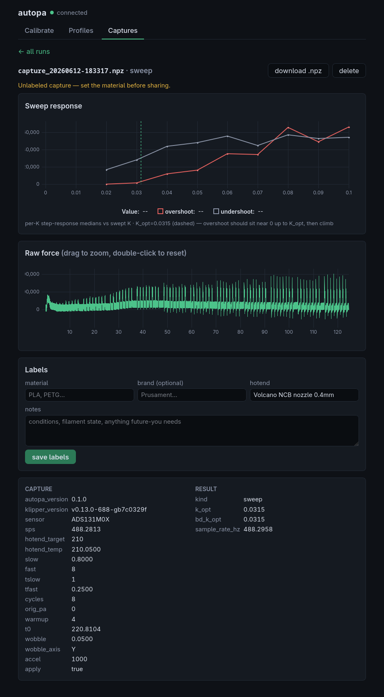
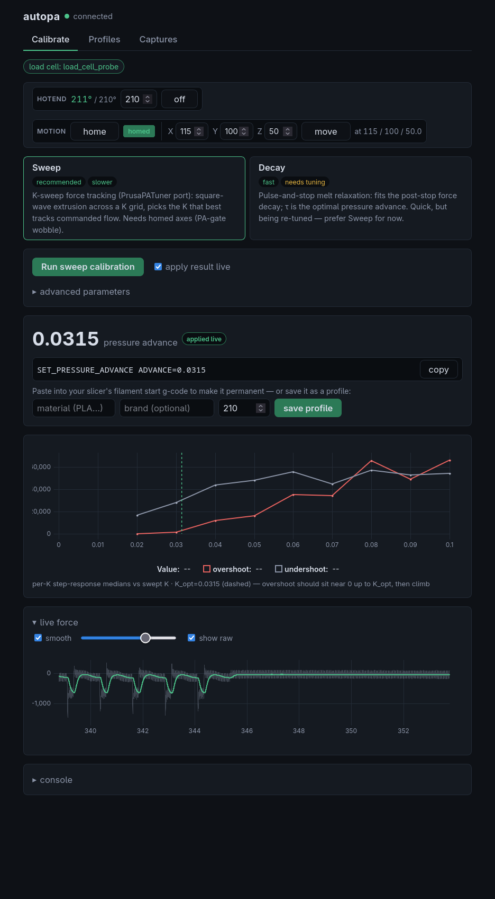

<p align="center">
  
</p>

<p align="center">
  <a href="LICENSE"></a>
  
  
  <a href="https://claude.com/claude-code"></a>
</p>

<p align="center">
  
  
  
</p>

**autopa** is automatic [Pressure Advance](https://www.klipper3d.org/Pressure_Advance.html)
calibration for [Klipper](https://www.klipper3d.org/), driven by a toolhead **load cell**.
Instead of slicing a test pattern and eyeballing corners, autopa measures the extruder melt
directly: it runs a short in-air extrusion routine, captures the force response, and reports
the pressure-advance value that fits it — then applies it live and hands you a paste-able
`SET_PRESSURE_ADVANCE` line. It can also remember the value per filament, so later prints
recall it instead of re-measuring.

> **The name:** *autopa* = **auto**matic **p**ressure **a**dvance. Always written lowercase.

> ⚠️ **Status: experimental.** autopa works and is in active use on the author's machine, but
> it's still young and actively being validated — interfaces, config, and the saved-capture
> format may still change. The **Sweep** method is the recommended path, with **Decay** as a
> faster alternative. Expect some rough edges.

## What it's for

Pressure advance is one of the biggest levers for clean, fast prints — too little blobs
corners, too much starves them. Its goals:

- **Measure, don't guess.** The number comes from a sensor, not from staring at a print.
- **Minimal configuration.** A bare `[autopa]` works; nothing material-specific is required.
- **Hardware-general by design.** Built to work with *any* Klipper `load_cell` /
  `load_cell_probe`, with no board- or nozzle-specific assumptions — the analysis works from
  the raw sensor signal rather than calibrated weight.
- **Use it your way.** Drive everything from the web UI or as plain g-code macros; both are
  first-class, and the UI is never a hard dependency.

## How it works

You park the toolhead, heat the nozzle, and run one command. From there, autopa extrudes a
short, controlled sequence **in the air**, records the load-cell force in real time, fits it,
and reports the optimal pressure advance. Two methods are available:

- **Sweep** *(recommended)* — sweeps PA across a grid with a slow/fast square-wave and picks
  the value with the cleanest force step-response. Ported from
  [PrusaPATuner](https://github.com/CNCKitchen/PrusaPATuner).
- **Decay** — measures the melt-pressure relaxation time after the filament
  stops; that time constant is the optimal PA.

Both methods are explained in **[docs/CALIBRATION.md](docs/CALIBRATION.md)**.
Calibrated values are stored per `(material[+brand], temperature)` and recalled on later
prints, so a filament is calibrated once rather than every time.

## Requirements

- A printer running **Klipper**.
- A **load cell** — a standalone
  [`[load_cell]`](https://www.klipper3d.org/Config_Reference.html#load_cell) or a
  [`[load_cell_probe]`](https://www.klipper3d.org/Config_Reference.html#load_cell_probe).

If you don't have a printer equipped with a load cell, the most approachable option is the
*Mellow Fly ALPSv6* (autopa's reference sensor). It can be installed in place of the common
E3D V6/Volcano heatsink (normal or shortened Voron-style, mounted with screws). See
**[docs/ALPS.md](docs/ALPS.md)** for flashing and setup, and **[docs/PROBE.md](docs/PROBE.md)**
for using it as a Z-probe.

## Installation

The web UI is optional: `install.sh` sets it up, but the calibration g-code works on its own.
Add `--no-nginx` to install only the Klipper extra and skip the UI.

```bash
# on the printer's SBC
git clone https://github.com/G0BL1N/autopa ~/autopa
cd ~/autopa
./install.sh                       # Klipper extra + web UI (use --no-nginx to skip the UI)
```

Add an `[autopa]` section to `printer.cfg` — options and ready-made workflow macros are in
**[autopa.cfg](autopa.cfg)** — then restart Klipper so it loads the new extra and config:

```bash
sudo systemctl restart klipper     # a plain RESTART does NOT reload extras
```

If you installed the UI, it's now at `http://<printer>/autopa/`.

## Using it

The methods and interfaces are all equally valid — use whichever fits. The quickest is the
**web UI**: calibrate and (optionally) store a value in a few clicks, then reuse it. For
automation, the same flow runs as plain **g-code macros** keyed off your slicer's material +
temperature — calibrate every print, calibrate only when a value is missing, paste a value
once, or save and recall. Each is a ready-made macro in **[autopa.cfg](autopa.cfg)**; stored
values are keyed per `(material[+brand], temperature)`, so a re-print never re-calibrates.

## Web UI

The optional [Svelte](https://svelte.dev/) single-page app is the easiest way to use autopa:
a method picker, a live force chart, calibration result plots, a profile manager, and a
browser for saved captures — served from the printer at `/autopa/`, with no extra server or
port.

## Contributing

**Sharing a capture (bug reports).** If calibration misbehaves, a saved `.npz` capture is the
most useful thing you can attach to an issue — but only if it's labeled correctly. The
`hotend` description is baked into a capture *at capture time* from your `[autopa]` config, so
**set `hotend` before the run**; if it was missing or wrong, fix it afterwards. Add the
material and any notes the same way. Annotate through the **web UI's capture view** (easiest
to fill in and to verify it reads back right) or with `AUTOPA_ANNOTATE`. Then **upload the
`.npz` and link it in a [GitHub issue](https://github.com/G0BL1N/autopa/issues)** rather than
committing it — the in-repo [`captures/`](captures/README.md) set is a small, hand-curated
fixture library, not a drop box. Fitting captures are added there manually.

**Working on the UI.** The web app is developed on a workstation, not the printer.
`cd web && npm install` then `npm run dev` runs it against a live printer
(`PRINTER=<host> npm run dev`), and `npm run build` produces the static `web/dist/` bundle
(`bun` works too). You only need this if you're changing the UI itself.

## Credits & license

autopa is an independent project built on **[Klipper](https://www.klipper3d.org/)** and
written with the help of **[Claude Code](https://claude.com/claude-code)**. Its **Sweep** method
incorporates the calibration algorithm derived from
**[PrusaPATuner](https://github.com/CNCKitchen/PrusaPATuner)** by CNCKitchen — full
attribution in **[CREDITS.md](CREDITS.md)**.

Released under the **GNU AGPL-3.0-or-later** — see **[LICENSE](LICENSE)**.
